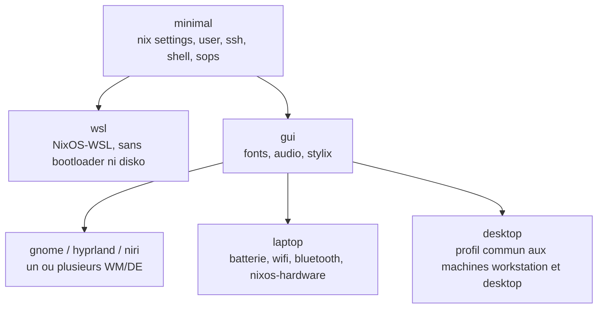

# NixOS state of the art

> Synthèse de la veille réalisée avant de réécrire la configuration NixOS from scratch: Documentation officielle, modules, home-manager, gestion des secrets, partitionnement déclaratif et outils incontournables en 2026. Le périmètre exact du projet est décrit dans [Scope](scope.md).

## What's new

- **Version stable actuelle: NixOS 26.05 "Yarara"**, sortie le 30 mai 2026. La **26.11 "Zokor"** est prévue pour fin novembre 2026. Ce projet suit `nixos-unstable`, toujours en avance sur la dernière version stable (voir [Nixpkgs channel](#nixpkgs-channel)).
- **L'initrd systemd est activé par défaut**. L'ancien initrd scripté est déprécié et sera supprimé en 26.11: Aucune option du type `boot.initrd.postDeviceCommands` dans la nouvelle configuration.

    !!! info "What is the initrd?"
        Au démarrage, le bootloader (systemd-boot) charge le noyau Linux et un petit système de fichiers placé en mémoire: L'**initrd** (initial ramdisk), aussi appelé **stage 1**. Son seul rôle est de préparer l'accès au vrai disque: Charger les pilotes (NVMe, USB…), demander le mot de passe LUKS si le disque est chiffré, monter la partition racine. Il passe ensuite la main au vrai système (**stage 2**).

        - **Avant**: Sur NixOS, ce stage 1 était un script shell propre à NixOS (l'initrd "scripté"). Des options comme `boot.initrd.postDeviceCommands` permettaient d'y glisser ses propres commandes shell.
        - **Maintenant**: Le stage 1 tourne avec systemd, comme le reste du système (`boot.initrd.systemd.enable = true` par défaut). Le démarrage est plus rapide, et le déverrouillage LUKS par TPM2 ou clé FIDO2 est mieux pris en charge.

        **Ce que ça change pour nous**: Pour une installation classique, rien. Mais pour lancer une action pendant le stage 1, on écrit un service systemd dans `boot.initrd.systemd.services` au lieu d'un bout de script. Exemple: Avec impermanence, beaucoup de guides anciens effacent le sous-volume btrfs racine via `postDeviceCommands`. Ces guides ne fonctionneront plus tels quels.
- **nixos-facter**: Ses modules sont intégrés à nixpkgs. Il remplace `hardware-configuration.nix` par un rapport JSON du matériel, à partir duquel la configuration matérielle est déduite automatiquement.

    !!! info "What does nixos-facter replace?"
        À l'installation, `nixos-generate-config` écrit `hardware-configuration.nix`: Les modules noyau nécessaires au démarrage (NVMe, USB…), les partitions à monter, le microcode du CPU. C'est une photo figée de la machine: Si le matériel change, il faut la regénérer à la main, et elle n'active rien de plus que le strict nécessaire pour démarrer.

        **nixos-facter** fait l'inverse: Il décrit seulement le matériel, dans un fichier `facter.json`, et ce sont les modules de NixOS qui en déduisent la configuration (modules noyau, microcode, firmware…).

        ``` { .console .codeblock title="Générer le rapport sur la machine" }
        $ sudo nix run nixpkgs#nixos-facter -- -o facter.json
        ```

        ``` { .nix .codeblock title="hosts/workstation/default.nix" }
        hardware.facter.reportPath = ./facter.json;
        ```

        **Avec disko**, les partitions sont déjà décrites par disko. facter + disko remplacent donc entièrement `hardware-configuration.nix`. nixos-anywhere peut aussi générer le rapport pendant l'installation (`--generate-hardware-config nixos-facter`).

        Le rapport est commité dans le repo: À relire avant, puisque le repo est public.
- **nixfmt** est devenu le formateur officiel (RFC 166).

    !!! info "What does it change?"
        Un **formateur** réécrit automatiquement le code avec une mise en forme unique (indentation, retours à la ligne, espaces), sans changer ce qu'il fait. Plus de débat de style, et des diffs git qui ne montrent que les vrais changements.

        Pendant longtemps, plusieurs formateurs Nix ont coexisté avec des styles différents (nixpkgs-fmt, alejandra, l'ancien nixfmt). Une **RFC** (Request For Comments) est le processus de décision de la communauté NixOS: La **RFC 166** a fixé un style officiel, et **nixfmt** est l'outil qui l'applique. nixpkgs lui-même est formaté avec, et sa CI le vérifie.

        Dans nixpkgs, le paquet s'appelle `nixfmt` (anciennement `nixfmt-rfc-style`). Pour que `nix fmt` formate tout le repo:

        ``` { .nix .codeblock title="flake.nix" }
        formatter.x86_64-linux = nixpkgs.legacyPackages.x86_64-linux.nixfmt-tree;
        ```

        Dans ce projet, il sera lancé via treefmt-nix et un hook git (voir [Must-have tools](#must-have-tools)).
- Côté structure, deux tendances fortes: **flake-parts** et le **pattern dendritique**.

## Architecture for 7 machines

Le livre [NixOS & Flakes](https://nixos-and-flakes.thiscute.world/) recommande une structure classique `hosts/`, `modules/`, `home/`, combinée avec `imports`, `lib.mkDefault` et `lib.mkForce` pour gérer les priorités. Elle fonctionne bien, mais avec 7 machines et 6 profils le câblage finit par se dupliquer.

### Dendritic pattern

Le pattern dendritique (flake-parts + import-tree) s'est largement répandu en 2025-2026. Chaque fichier correspond à une *fonctionnalité* et déclare à la fois sa partie NixOS et sa partie home-manager. Une machine se résume à la liste des fonctionnalités qu'elle importe.

``` { .nix .codeblock title="modules/hyprland.nix" }
# Une seule fonctionnalité: système et home au même endroit
flake.modules.nixos.hyprland = { programs.hyprland.enable = true; };
flake.modules.homeManager.hyprland = { wayland.windowManager.hyprland = { /* ... */ }; };
```

``` { .nix .codeblock title="hosts/desktop/default.nix" }
flake.nixosConfigurations.desktop = inputs.nixpkgs.lib.nixosSystem {
  modules = with inputs.self.modules.nixos; [
    minimal gui hyprland desktop gaming mathod
  ];
};
```

|      | Dendritic pattern                                                                                                                              |
| ---- | ---------------------------------------------------------------------------------------------------------------------------------------------- |
| Pros | Ajouter une machine ne touche aucun autre fichier. `nix flake show` montre la vraie structure. Plus aucune option `enable` à câbler à la main. |
| Cons | Plus abstrait, documentation encore maigre. On suit un registre plutôt qu'un simple grep pour déboguer.                                        |

!!! tip "Recommendation"
    flake-parts + pattern dendritique, parce qu'il correspond exactement au besoin: Des profils qui s'empilent et des fonctionnalités à cheval entre système et home. La structure classique `hosts/` + `modules/` reste un choix valable si l'on préfère un modèle plus explicite pour reprendre en main.

    !!! success "Decision"
        **flake-parts + pattern dendritique** est retenu.

        Chaque machine liste explicitement les aspects qu'elle importe, sans héritage automatique entre profils. Les profils sont `minimal`, `gui`, `desktop`, `laptop` et `wsl`. Des aspects plus fins s'ajoutent à la carte, par machine (`gaming`…).

        La couche graphique s'appelle **`gui`**: Une base commune (polices, audio, stylix…), et chaque WM ou DE en aspect séparé (`gnome`, `hyprland`, `niri`). Plusieurs peuvent être actifs sur la même machine, le choix se fait à l'écran de connexion, le temps de décider lesquels garder.

        Les machines `workstation` et `desktop` (le PC gaming) sont deux machines différentes, avec le même profil `desktop`. Seuls leur matériel (`facter.json`, `disk.nix`) et leurs aspects en plus diffèrent.

        | Machine       | Aspects                                  |
        | ------------- | ---------------------------------------- |
        | `workstation` | `minimal` + `gui` + `desktop`            |
        | `desktop`     | `minimal` + `gui` + `desktop` + `gaming` |

        Une machine peut porter le nom d'un profil (`desktop`, `laptop`): Les machines sont déclarées dans `flake.nixosConfigurations`, les profils dans le registre `flake.modules.nixos`, deux espaces de noms séparés.

        ```
        modules/
        ├── profiles/   minimal.nix  desktop.nix  laptop.nix  wsl.nix
        ├── gui/        gui.nix  gnome.nix  hyprland.nix  niri.nix
        ├── features/   gaming.nix  ...
        └── users/      mathod.nix
        hosts/
        ├── workstation/   default.nix  facter.json  disk.nix
        └── desktop/       default.nix  facter.json  disk.nix
        ```

### Profiles

Les profils se combinent: Chaque machine liste ceux qu'elle utilise, toujours à partir de `minimal`. `gui` est la couche graphique commune, et chaque WM ou DE est un aspect séparé. Des aspects à la carte (`gaming`…) s'ajoutent par machine.



### Nixpkgs channel

Toutes les machines suivent la même branche de nixpkgs, `nixos-unstable`, et tous les inputs déclarent `inputs.nixpkgs.follows = "nixpkgs"` pour éviter les doublons de nixpkgs.

!!! info "Stable and unstable"
    **nixpkgs** est le dépôt qui contient tous les paquets et tous les modules NixOS. On le suit à travers une branche:

    - **`nixos-26.05`** (stable): Les versions sont figées à la sortie. Seules les corrections de sécurité et de bugs arrivent, jusqu'à la fin du support.
    - **`nixos-unstable`**: Les dernières versions, mises à jour en continu dès que les tests passent. Plus frais, mais une mise à jour peut parfois casser quelque chose.

    Un **input** est une dépendance du flake, et `flake.lock` fixe le commit exact de chacun. Rien ne change tant que `flake.lock` n'est pas mis à jour.

    **`follows`**: Sans lui, chaque input (home-manager, sops-nix…) apporte sa propre copie de nixpkgs. Résultat: Des téléchargements et des évaluations en double, et des bibliothèques de versions différentes qui cohabitent. `follows` leur dit d'utiliser le nixpkgs du flake.

    !!! tip "Good to know: Overlays"
        Un **overlay** modifie ou complète l'ensemble des paquets `pkgs`. Il permet notamment de prendre quelques paquets dans une autre branche que celle du système, en déclarant un second input nixpkgs.

        Sur un système en unstable, le cas utile est l'inverse du cas habituel: Si un paquet est cassé en unstable, on le récupère temporairement depuis la branche stable.

        ``` { .nix .codeblock title="flake.nix" }
        inputs = {
          nixpkgs.url = "github:NixOS/nixpkgs/nixos-unstable";
          nixpkgs-stable.url = "github:NixOS/nixpkgs/nixos-26.05";
        };
        ```

        ``` { .nix .codeblock title="modules/profiles/minimal.nix" }
        nixpkgs.overlays = [
          (final: prev: {
            stable = import inputs.nixpkgs-stable {
              inherit (prev.stdenv.hostPlatform) system;
              config.allowUnfree = true;
            };
          })
        ];
        ```

        Le paquet s'écrit alors `pkgs.stable.terraform` au lieu de `pkgs.terraform`. Ce paquet stable utilise les bibliothèques de la branche stable (glibc, openssl…), téléchargées en plus de celles d'unstable: Ça prend un peu plus de place sur le disque. À éviter pour ce qui touche au bureau ou aux pilotes graphiques (Mesa), où mélanger deux branches pose problème.

    !!! success "Decision"
        **`nixos-unstable` est retenu pour les 7 machines**, sans branche stable à côté.

        Pourquoi:

        - **Une seule branche pour tout**: Pas de versions différentes à suivre entre les machines ou entre les paquets.
        - **La branche n'avance que quand les tests passent**: `nixos-unstable` ne reçoit un commit que si les tests NixOS (démarrage, bureaux, services clés) sont au vert. Ce n'est pas du code de développement brut.
        - **Les mises à jour se font quand on le décide**: Rien ne bouge tant que `flake.lock` n'est pas mis à jour, et une mise à jour ratée se corrige en redémarrant sur la génération précédente.
        - **La CI filtre la casse**: La PR hebdomadaire de mise à jour de `flake.lock` construit toutes les machines avant d'être fusionnée.
        - **Du matériel et des WM récents**: Derniers pilotes graphiques, noyau et Mesa pour le PC gaming. Hyprland et niri évoluent vite, et leurs communautés utilisent surtout unstable.
        - **Pas de migration majeure tous les 6 mois**.

        Conséquence: home-manager suit sa branche `master`, alignée sur `nixos-unstable`.

        ``` { .nix .codeblock title="flake.nix" }
        inputs = {
          nixpkgs.url = "github:NixOS/nixpkgs/nixos-unstable";
          home-manager = {
            url = "github:nix-community/home-manager";
            inputs.nixpkgs.follows = "nixpkgs";
          };
        };
        ```

## Home-manager

- **En module NixOS** (recommandé ici): Un seul `nixos-rebuild switch` (ou `nh os switch`) déploie système et home. Réglages clés: `useGlobalPkgs = true`, `useUserPackages = true`, `backupFileExtension = "bak"`, et `sharedModules` pour les modules communs. Branche `master`, alignée sur `nixos-unstable`.
- **En standalone** (`homeConfigurations`): Utile pour une machine qui n'est pas sous NixOS, par exemple une Debian WSL. La même configuration home peut exposer les deux sorties.
- `home.stateVersion` et `system.stateVersion` valent la version de NixOS au moment de l'installation de la machine (`"26.05"` pour la workstation) et ne sont jamais modifiés ensuite.

!!! note
    **hjem** existe comme alternative légère à home-manager. home-manager reste le choix retenu.

``` { .nix .codeblock title="flake.nix (extrait)" }
home-manager = {
  url = "github:nix-community/home-manager";
  inputs.nixpkgs.follows = "nixpkgs";
};
```

## Secrets: sops-nix + age on a public repo

Tous les secrets sont chiffrés avec **une seule clé age**. Sa version chiffrée par passphrase est commitée dans ce repo. Chaque machine en reçoit une copie déchiffrée à l'installation, et sops-nix s'en sert pour déchiffrer les secrets à chaque démarrage.

### Flow

```text
REPO PUBLIC
  secrets/age-key.txt.age   ← la clé age, chiffrée par la passphrase
  secrets/*.yaml            ← les secrets, chiffrés pour cette clé age
        │
        │ 1. Installation d'une machine (une seule fois)
        │    passphrase tapée à la main → age déchiffre la clé
        ▼
MACHINE (disque chiffré par LUKS)
  /var/lib/sops-nix/key.txt ← clé age en clair, lisible uniquement par root
        │
        │ 2. À chaque démarrage et à chaque rebuild, automatiquement
        │    sops-nix lit key.txt → déchiffre les secrets
        ▼
  /run/secrets/…            ← secrets en clair, en mémoire vive uniquement
```

### Keys

| Key           | Location                                                                             | Passphrase | Role                               |
| ------------- | ------------------------------------------------------------------------------------ | ---------- | ---------------------------------- |
| Clé age       | `secrets/age-key.txt.age` (chiffrée), `/var/lib/sops-nix/key.txt` sur chaque machine | Oui        | Déchiffrer tous les secrets        |
| Clé SSH perso | Secret sops, déployé dans `~/.ssh/` sur chaque machine                               | Oui        | Se connecter à toutes les machines |

Les clés SSH d'hôte (`/etc/ssh/ssh_host_*`) existent sur chaque machine, mais sops ne s'en sert pas.

``` { .yaml .codeblock title=".sops.yaml" }
creation_rules:
  - path_regex: secrets/.*\.yaml$
    age: age1...
```

``` { .nix .codeblock title="modules/features/sops.nix" }
sops = {
  defaultSopsFile = inputs.self + "/secrets/common.yaml";
  age.keyFile = "/var/lib/sops-nix/key.txt";
  # Les clés SSH d'hôte ne servent pas à déchiffrer
  age.sshKeyPaths = [ ];
  gnupg.sshKeyPaths = [ ];
};
```

La mise en place réelle de la clé SSH `nixos` (création des clés, serveur, client, nouvelle machine) est décrite dans [SSH](ssh.md).

Pour éditer un secret, sops lit la copie de la clé présente sur la machine:

``` { .console .codeblock }
$ SOPS_AGE_KEY_CMD="sudo cat /var/lib/sops-nix/key.txt" sops secrets/common.yaml
```

Fonctionnalités utiles:

- `neededForUsers = true` pour les mots de passe utilisateurs (`hashedPasswordFile`);
- `sops.templates` pour injecter un secret dans un fichier de configuration.

### New machine

1. Installer NixOS sur la machine.
2. Déchiffrer la clé age du repo vers la machine, en tapant la passphrase (sur une installation fraîche, `age` s'obtient avec `nix-shell -p age`):

    ``` { .console .codeblock }
    $ sudo mkdir -p -m 700 /var/lib/sops-nix
    $ age -d secrets/age-key.txt.age | sudo sh -c 'umask 077; cat > /var/lib/sops-nix/key.txt'
    ```

3. Reconstruire le système: sops-nix déchiffre les secrets.

Avec nixos-anywhere, la clé est déchiffrée localement dans un dossier temporaire (`$temp/var/lib/sops-nix/key.txt`), puis copiée sur la machine pendant l'installation avec `--extra-files "$temp"`.

!!! warning "Public repo pitfalls"
    - Les *noms* des clés YAML restent en clair, seules les valeurs sont chiffrées.
    - Attention aux métadonnées commitées en clair: IP, noms de domaine, emails, SSID wifi.
    - Un hook pre-commit qui refuse tout fichier `secrets/` non chiffré est une bonne sécurité.

!!! success "Decision"
    **Tout est dans ce repo public**, sans second repo privé, avec **une seule clé age et une seule clé SSH perso** pour toutes les machines.

    - **Clé age**: Dédiée à sops, commitée chiffrée par une passphrase unique et tirée au hasard (`age -p`).
    - **Sur chaque machine**: Une copie déchiffrée à l'installation dans `/var/lib/sops-nix/key.txt`, lisible uniquement par root, sur un disque chiffré par LUKS. sops-nix déchiffre ainsi les secrets sans passphrase, à chaque démarrage.
    - **Clé SSH perso**: Une seule, protégée par une passphrase, stockée dans un secret sops et déployée dans `~/.ssh/` sur chaque machine. Sa clé publique est déclarée dans `users.users.mathod.openssh.authorizedKeys`.
    - **Déchiffrement au niveau système uniquement**: Les secrets personnels sont déchiffrés avec `owner = "mathod"`. Le module home-manager de sops-nix n'est pas utilisé, puisque la clé n'est lisible que par root.

    Le compromis accepté: Machine éteinte, LUKS protège tout. Machine allumée, un accès root permet de lire la clé, et donc les secrets de toutes les machines. Ce process pourra être revu plus tard si besoin (une clé par machine, ou une clé scellée dans la puce TPM).

    Le fichier de clé chiffré reste public pour toujours, et n'importe qui peut essayer de le casser hors ligne. Toute la sécurité du repo repose donc sur la passphrase: Unique, tirée au hasard, et conservée dans un gestionnaire de mots de passe avec une copie hors ligne.

## Partitioning and installation

- **disko**: Partitionnement, formatage et montage déclarés en Nix (GPT, LUKS, LVM, btrfs, ZFS, bcachefs…). La même définition sert à l'installation *et* génère les `fileSystems` de la configuration.
- **nixos-anywhere**: Installe NixOS à distance par SSH depuis n'importe quel Linux (kexec, 1 Go de RAM minimum, réseau filaire). Il enchaîne disko, l'installation, les `--extra-files` pour la clé sops et la génération du rapport facter. Sur 7 machines, c'est le principal gain de temps.
- **disko-install**: La variante locale, depuis une clé USB d'installation.

``` { .console .codeblock title="Installation distante" }
$ nixos-anywhere --extra-files "$temp" --flake .#<host> --target-host root@<ip>
```

!!! info "Proposed layout for laptop, desktop and workstation"
    ESP de 1 Go, puis LUKS2, puis btrfs avec les sous-volumes `@root`, `@home`, `@nix`, `@persist`, `@swap`, montés en `compress=zstd,noatime`. ZFS reste possible pour une workstation. Pas de disko sur WSL.

## Must-have tools

| Tool                                                                   | Why                                                                                                                                                                 |
| ---------------------------------------------------------------------- | ------------------------------------------------------------------------------------------------------------------------------------------------------------------- |
| **nh**                                                                 | Remplace `nixos-rebuild` et `home-manager switch`: Arbre de build (nix-output-monitor), diff des paquets, confirmation avant activation, `nh clean --keep-since 4d` |
| **nix-index-database + comma**                                         | `, cowsay` lance un binaire sans l'installer, et le command-not-found fonctionne réellement                                                                         |
| **direnv + nix-direnv**                                                | devShells par projet, mis en cache                                                                                                                                  |
| **nixfmt + statix + deadnix** via **treefmt-nix** et **git-hooks.nix** | Formatage et lint automatiques au commit                                                                                                                            |
| **stylix**                                                             | Thème et polices unifiés sur tout le système et les applications                                                                                                    |
| **nixos-hardware**                                                     | Réglages spécifiques par modèle de laptop                                                                                                                           |
| **nixos-facter**                                                       | Remplace `hardware-configuration.nix`                                                                                                                               |
| **nix-ld**                                                             | Exécuter des binaires non-Nix (VS Code server, outils téléchargés…)                                                                                                 |
| **lanzaboote**                                                         | Secure Boot. Encore quelques angles vifs, à garder en option                                                                                                        |
| **impermanence**                                                       | Racine effacée à chaque boot, seul `/persist` est conservé. Très propre mais exigeant, donc optionnel                                                               |
| **CI GitHub Actions**                                                  | `nix flake check` sur chaque PR et PR automatique hebdomadaire de mise à jour de `flake.lock`                                                                       |
| **justfile**                                                           | Raccourcis (`just switch`, `just update`, `just install`)                                                                                                           |

Pour déployer sur 7 machines, `nh os switch --target-host` peut suffire. Sinon: **deploy-rs** ou **colmena** (push), ou **comin** (chaque machine se met à jour seule depuis git).

## Sources

- [NixOS & Flakes Book](https://nixos-and-flakes.thiscute.world/): [modularisation](https://nixos-and-flakes.thiscute.world/nixos-with-flakes/modularize-the-configuration), [home-manager](https://nixos-and-flakes.thiscute.world/nixos-with-flakes/start-using-home-manager), [best practices](https://nixos-and-flakes.thiscute.world/best-practices/intro)
- Stéphane Robert: [Nix Flakes](https://blog.stephane-robert.info/docs/admin-serveurs/linux/references-complementaires/nix/flakes/), [factorisation et pinning](https://blog.stephane-robert.info/docs/admin-serveurs/linux/references-complementaires/nix/import-factorisation-pinning/)
- [Annonce NixOS 26.05](https://nixos.org/blog/announcements/2026/nixos-2605/), [release notes](https://nixos.org/manual/nixos/stable/release-notes)
- [Home Manager manual](https://nix-community.github.io/home-manager/)
- [sops-nix](https://github.com/Mic92/sops-nix), [disko](https://github.com/nix-community/disko), [nixos-anywhere](https://github.com/nix-community/nixos-anywhere) ([secrets howto](https://github.com/nix-community/nixos-anywhere/blob/main/docs/howtos/secrets.md)), [nixos-facter](https://github.com/nix-community/nixos-facter)
- [NixOS-WSL](https://github.com/nix-community/NixOS-WSL): [documentation](https://nix-community.github.io/NixOS-WSL/), [flakes](https://nix-community.github.io/NixOS-WSL/how-to/nix-flakes.html)
- Pattern dendritique: [Exploring the Dendritic Nix Pattern](https://britter.dev/blog/2026/05/11/exploring-the-dendritic-nix-pattern/), [Dendrix](https://dendrix.denful.dev/Dendritic.html), [nix-book](https://saylesss88.github.io/flakes/dendritic_flake_parts.html)
- [The NixOS Tools That Actually Make a Difference](https://iampavel.dev/blog/best-nixos-tools), [best-of-nix](https://github.com/tolkonepiu/best-of-nix), [awesome-nix](https://nix-community.github.io/awesome-nix/)
- [Secure Boot, wiki officiel](https://wiki.nixos.org/wiki/Secure_Boot)
