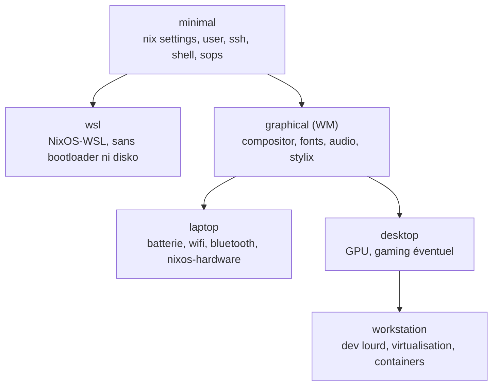

# NixOS: état de l'art et architecture cible

Synthèse de la veille réalisée avant de réécrire la configuration NixOS from scratch: documentation officielle, modules, home-manager, gestion des secrets, partitionnement déclaratif et outils incontournables en 2026. Le périmètre exact du projet est décrit dans [Scope](scope.md).

## Ce qui a changé récemment

- **Version stable actuelle: NixOS 26.05 "Yarara"**, sortie le 30 mai 2026 et maintenue jusqu'au 31 décembre 2026. La **26.11 "Zokor"** est prévue pour fin novembre 2026, une migration est donc à prévoir peu après la réécriture.
- **L'initrd systemd est activé par défaut**. L'ancien initrd scripté est déprécié et sera supprimé en 26.11: aucune option du type `boot.initrd.postDeviceCommands` dans la nouvelle configuration.
- **nixos-facter**: ses modules sont intégrés à nixpkgs. Il remplace `hardware-configuration.nix` par un rapport JSON du matériel, à partir duquel la configuration matérielle est déduite automatiquement.
- **nixfmt** est devenu le formateur officiel (RFC 166).
- Côté structure, deux tendances fortes: **flake-parts** et le **pattern dendritique**.

## Architecture pour 7 machines

Le livre [NixOS & Flakes](https://nixos-and-flakes.thiscute.world/) recommande une structure classique `hosts/`, `modules/`, `home/`, combinée avec `imports`, `lib.mkDefault` et `lib.mkForce` pour gérer les priorités. Elle fonctionne bien, mais avec 7 machines et 6 profils le câblage finit par se dupliquer.

### Le pattern dendritique

Le pattern dendritique (flake-parts + import-tree) s'est largement répandu en 2025-2026. Chaque fichier correspond à une *fonctionnalité* et déclare à la fois sa partie NixOS et sa partie home-manager. Une machine se résume à la liste des fonctionnalités qu'elle importe.

``` { .nix .codeblock title="modules/hyprland.nix" }
# Une seule fonctionnalité: système et home au même endroit
flake.modules.nixos.hyprland = { programs.hyprland.enable = true; };
flake.modules.homeManager.hyprland = { wayland.windowManager.hyprland = { /* ... */ }; };
```

``` { .nix .codeblock title="hosts/laptop-x.nix" }
flake.modules.nixos.laptop-x.imports = with inputs.self.modules.nixos; [
  base laptop hyprland dev mathod
];
```

| | Pattern dendritique |
| --- | --- |
| Avantages | Ajouter une machine ne touche aucun autre fichier. `nix flake show` montre la vraie structure. Plus aucune option `enable` à câbler à la main. |
| Inconvénients | Plus abstrait, documentation encore maigre. On suit un registre plutôt qu'un simple grep pour déboguer. |

!!! tip "Recommandation"
    flake-parts + pattern dendritique, parce qu'il correspond exactement au besoin: des profils qui s'empilent et des fonctionnalités à cheval entre système et home. La structure classique `hosts/` + `modules/` reste un choix valable si l'on préfère un modèle plus explicite pour reprendre en main.

### Profils

Les profils s'empilent plutôt qu'ils ne s'excluent. "WM" est une couche graphique plutôt qu'un type de machine.



### Canal nixpkgs

La base proposée est `nixos-26.05`, avec un input `nixpkgs-unstable` pour quelques paquets précis exposés via overlay (`pkgs.unstable.xxx`). Tous les inputs déclarent `inputs.nixpkgs.follows = "nixpkgs"` pour éviter les doublons de nixpkgs. L'alternative est de tout passer en unstable: paquets plus frais, mais plus de casse.

## Home-manager

- **En module NixOS** (recommandé ici): un seul `nixos-rebuild switch` (ou `nh os switch`) déploie système et home. Réglages clés: `useGlobalPkgs = true`, `useUserPackages = true`, `backupFileExtension = "bak"`, et `sharedModules` pour les modules communs. Branche `release-26.05`, alignée sur nixpkgs.
- **En standalone** (`homeConfigurations`): utile pour une machine qui n'est pas sous NixOS, par exemple une Debian WSL. La même configuration home peut exposer les deux sorties.
- `home.stateVersion` et `system.stateVersion` valent `"26.05"` sur les nouvelles installations et ne sont jamais modifiés ensuite.

!!! note
    **hjem** existe comme alternative légère à home-manager. home-manager reste le choix retenu.

``` { .nix .codeblock title="flake.nix (extrait)" }
home-manager = {
  url = "github:nix-community/home-manager/release-26.05";
  inputs.nixpkgs.follows = "nixpkgs";
};
```

## Secrets: sops-nix + age sur un repo public

Chaque fichier `secrets/*.yaml` est chiffré pour plusieurs destinataires age:

- **une clé personnelle** (admin), générée avec `age-keygen`, jamais commitée et sauvegardée hors ligne (gestionnaire de mots de passe, papier, clé USB);
- **une clé par machine**, dérivée de sa clé SSH hôte ed25519 avec `ssh-to-age`. Côté module: `sops.age.sshKeyPaths = [ "/etc/ssh/ssh_host_ed25519_key" ]`.

``` { .yaml .codeblock title=".sops.yaml" }
keys:
  - &mathod age1...
  - &laptop-x age1...
  - &desktop-y age1...
creation_rules:
  - path_regex: secrets/common\.yaml$
    key_groups: [{ age: [*mathod, *laptop-x, *desktop-y] }]
  - path_regex: secrets/hosts/laptop-x\.yaml$
    key_groups: [{ age: [*mathod, *laptop-x] }]
```

Fonctionnalités utiles:

- `neededForUsers = true` pour les mots de passe utilisateurs (`hashedPasswordFile`);
- `sops.templates` pour injecter un secret dans un fichier de configuration;
- un module home-manager pour les secrets utilisateur.

### Nouvelle machine: l'œuf et la poule

1. Générer la clé SSH hôte de la machine **avant** l'installation.
2. Ajouter sa clé age dans `.sops.yaml`, puis lancer `sops updatekeys`.
3. Injecter la clé à l'installation avec `nixos-anywhere --extra-files` (procédure documentée officiellement).

!!! warning "Points de vigilance sur un repo public"
    - Les *noms* des clés YAML restent en clair, seules les valeurs sont chiffrées.
    - Attention aux métadonnées commitées en clair: IP, noms de domaine, emails, SSID wifi.
    - Variante courante: un **second repo privé** `nix-secrets` utilisé comme input du flake. Ce n'est pas obligatoire, sops sur un repo public est un usage standard.
    - Un hook pre-commit qui refuse tout fichier `secrets/` non chiffré est une bonne sécurité.

## Partitionnement et installation

- **disko**: partitionnement, formatage et montage déclarés en Nix (GPT, LUKS, LVM, btrfs, ZFS, bcachefs…). La même définition sert à l'installation *et* génère les `fileSystems` de la configuration.
- **nixos-anywhere**: installe NixOS à distance par SSH depuis n'importe quel Linux (kexec, 1 Go de RAM minimum, réseau filaire). Il enchaîne disko, l'installation, les `--extra-files` pour la clé sops et la génération du rapport facter. Sur 7 machines, c'est le principal gain de temps.
- **disko-install**: la variante locale, depuis une clé USB d'installation.

``` { .console .codeblock title="Installation distante" }
$ nixos-anywhere --extra-files "$temp" --flake .#<host> --target-host root@<ip>
```

!!! info "Layout proposé pour laptop, desktop et workstation"
    ESP de 1 Go, puis LUKS2, puis btrfs avec les sous-volumes `@root`, `@home`, `@nix`, `@persist`, `@swap`, montés en `compress=zstd,noatime`. ZFS reste possible pour une workstation. Pas de disko sur WSL.

## Outils incontournables

| Outil | Intérêt |
| --- | --- |
| **nh** | Remplace `nixos-rebuild` et `home-manager switch`: arbre de build (nix-output-monitor), diff des paquets, confirmation avant activation, `nh clean --keep-since 4d` |
| **nix-index-database + comma** | `, cowsay` lance un binaire sans l'installer, et le command-not-found fonctionne réellement |
| **direnv + nix-direnv** | devShells par projet, mis en cache |
| **nixfmt + statix + deadnix** via **treefmt-nix** et **git-hooks.nix** | Formatage et lint automatiques au commit |
| **stylix** | Thème et polices unifiés sur tout le système et les applications |
| **nixos-hardware** | Réglages spécifiques par modèle de laptop |
| **nixos-facter** | Remplace `hardware-configuration.nix` |
| **nix-ld** | Exécuter des binaires non-Nix (VS Code server, outils téléchargés…) |
| **lanzaboote** | Secure Boot. Encore quelques angles vifs, à garder en option |
| **impermanence** | Racine effacée à chaque boot, seul `/persist` est conservé. Très propre mais exigeant, donc optionnel |
| **CI GitHub Actions** | `nix flake check` sur chaque PR et PR automatique hebdomadaire de mise à jour de `flake.lock` |
| **justfile** | Raccourcis (`just switch`, `just update`, `just install`) |

Pour déployer sur 7 machines, `nh os switch --target-host` peut suffire. Sinon: **deploy-rs** ou **colmena** (push), ou **comin** (chaque machine se met à jour seule depuis git).

## Sources

- [NixOS & Flakes Book](https://nixos-and-flakes.thiscute.world/): [modularisation](https://nixos-and-flakes.thiscute.world/nixos-with-flakes/modularize-the-configuration), [home-manager](https://nixos-and-flakes.thiscute.world/nixos-with-flakes/start-using-home-manager), [best practices](https://nixos-and-flakes.thiscute.world/best-practices/intro)
- Stéphane Robert: [Nix Flakes](https://blog.stephane-robert.info/docs/admin-serveurs/linux/references-complementaires/nix/flakes/), [factorisation et pinning](https://blog.stephane-robert.info/docs/admin-serveurs/linux/references-complementaires/nix/import-factorisation-pinning/)
- [Annonce NixOS 26.05](https://nixos.org/blog/announcements/2026/nixos-2605/), [release notes](https://nixos.org/manual/nixos/stable/release-notes)
- [Home Manager manual](https://nix-community.github.io/home-manager/)
- [sops-nix](https://github.com/Mic92/sops-nix), [disko](https://github.com/nix-community/disko), [nixos-anywhere](https://github.com/nix-community/nixos-anywhere) ([secrets howto](https://github.com/nix-community/nixos-anywhere/blob/main/docs/howtos/secrets.md)), [nixos-facter](https://github.com/nix-community/nixos-facter)
- [NixOS-WSL](https://github.com/nix-community/NixOS-WSL) ([flakes](https://nix-community.github.io/NixOS-WSL/how-to/nix-flakes.html))
- Pattern dendritique: [Exploring the Dendritic Nix Pattern](https://britter.dev/blog/2026/05/11/exploring-the-dendritic-nix-pattern/), [Dendrix](https://dendrix.denful.dev/Dendritic.html), [nix-book](https://saylesss88.github.io/flakes/dendritic_flake_parts.html)
- [The NixOS Tools That Actually Make a Difference](https://iampavel.dev/blog/best-nixos-tools), [best-of-nix](https://github.com/tolkonepiu/best-of-nix), [awesome-nix](https://nix-community.github.io/awesome-nix/)
- [Secure Boot, wiki officiel](https://wiki.nixos.org/wiki/Secure_Boot)
